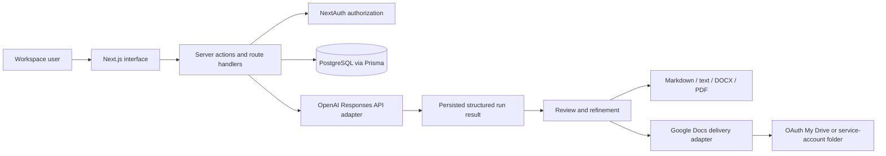

# AI Content Automation with Google Docs Delivery

**Code and architecture case study — live deployment currently unavailable.**

A multi-tenant Next.js application demonstrating structured content briefs, AI-assisted generation workflows, reviewable outputs, deterministic exports, and Google Docs delivery architecture. Provider-backed generation and delivery require separate configuration and are not represented as independently verified live outcomes.

[Architecture](docs/ARCHITECTURE.md) · [API flow](docs/API_FLOW.md) · [Deployment requirements](docs/DEPLOYMENT.md) · [Portfolio](https://getrelayworks.com/work/)

## Problem and workflow

Content teams often move manually between intake forms, prompts, chat tools, review documents, and shared folders. That makes output inconsistent and obscures which brief, model run, or revision produced a deliverable. This project demonstrates how those steps can be organized into a database-backed workflow while preserving human review.

## What this project demonstrates

- Workspace-scoped briefs, reusable presets, memberships, and saved run history
- OpenAI Responses API integration code with schema-backed structured outputs
- Safety checks before generation and section-level refinement after generation
- Deterministic Markdown, plain-text, DOCX, and PDF export paths
- Google Docs integration architecture using owner OAuth or a shared-folder service account
- Email verification, password reset, database-backed auth rate limiting, and protected routes
- Per-run job and delivery state, destination metadata, and external-document link storage
- Automated validation structure for authentication, tenancy, generation actions, exports, and delivery services

Implementation in the repository demonstrates these application boundaries. Successful live OpenAI generation or Google Docs delivery is not asserted without separate provider and environment verification.

## Authentic screenshot

This approved capture uses an opt-in seeded account and synthetic workspace data. It demonstrates the structured brief experience only; it does not represent a verified live OpenAI request or Google Docs delivery.


Additional verified synthetic-data captures: [seeded dashboard](docs/assets/screenshots/dashboard-seeded-workspace-desktop.png), [product overview](docs/assets/screenshots/marketing-desktop.png), [mobile product overview](docs/assets/screenshots/marketing-mobile.png), and [mobile workspace](docs/assets/screenshots/workspace-brief-mobile.png). Capture boundaries are documented in [`docs/SCREENSHOTS.md`](docs/SCREENSHOTS.md).

## Architecture



Provider clients remain server-only, workspace access is checked before mutations, and persisted run data separates generation from delivery. Generation, formatting, and Google delivery live in focused server modules rather than UI components. See [`docs/ARCHITECTURE.md`](docs/ARCHITECTURE.md) and [`docs/API_FLOW.md`](docs/API_FLOW.md).

## Technology stack

- Next.js 16 App Router, React 19, TypeScript, and Tailwind CSS 4
- Prisma and PostgreSQL
- NextAuth credentials authentication with Prisma adapter and JWT sessions
- OpenAI official SDK and Responses API
- Google APIs SDK for OAuth and Google Docs delivery
- Zod, React Hook Form, Vitest, Nodemailer, PDFKit, and DOCX

## Local evaluation

Prerequisites: Node.js 20.9+, npm, PostgreSQL, and an OpenAI API key for provider-backed generation.

```bash
git clone https://github.com/DevCalebR/ai-content-automation-app-google-docs-delivery.git
cd ai-content-automation-app-google-docs-delivery
npm ci
cp .env.example .env
```

Required for the core workflow:

- `DATABASE_URL`
- `OPENAI_API_KEY` and an available `OPENAI_MODEL`
- `APP_URL`, `NEXTAUTH_URL`, and a unique 32+ character `NEXTAUTH_SECRET`

SMTP configuration enables real verification and reset email. Google OAuth credentials enable owner My Drive delivery; service-account credentials enable the shared-folder path. Keep secrets server-side and never commit `.env` files. See [`.env.example`](.env.example) for the complete contract.

Prepare and start a development environment with:

```bash
npm run db:generate
npm run db:migrate:dev -- --name init
npm run db:seed
npm run dev
```

Open `http://localhost:3000`, create an account, follow the configured verification path, and create a workspace. Demo seeding is opt-in and requires evaluator-supplied local-only credentials. Provider-backed paths require the evaluator's own accounts, credentials, quotas, and consent configuration.

## Validation

The documentation reconciliation was checked with:

```bash
npm run lint
npm run typecheck
npm run test
npm run build
```

Verified results for this documentation PR:

- Lint passed.
- Typecheck passed.
- The production build passed with non-secret local validation values.
- Twenty-nine tests passed before environment-dependent failures.
- The remaining tests require the repository's runtime variables and a reachable, disposable PostgreSQL test database.

The database-dependent limitation is configuration-related and was not bypassed with application changes or persistence mocks. Live OpenAI and Google Workspace behavior also requires the manual checks in [`docs/MANUAL_QA_CHECKLIST.md`](docs/MANUAL_QA_CHECKLIST.md).

## Deployment requirements

The live deployment is currently unavailable. A future deployment requires persistent PostgreSQL, hosting-platform secrets, deployed database migrations, canonical application/authentication URLs, an approved Google OAuth redirect URI where OAuth is used, and verified email delivery before public sign-up. See [`docs/DEPLOYMENT.md`](docs/DEPLOYMENT.md) and [`docs/TROUBLESHOOTING.md`](docs/TROUBLESHOOTING.md).

## Project structure

```text
app/                 Marketing, authentication, workspace UI, and server actions
components/          Brief, result, settings, and shared interface components
lib/ai/              Prompt composition, safety, and OpenAI generation adapter
lib/auth/            Credentials, sessions, verification, reset, and rate limits
lib/data/            Workspace-scoped query helpers
lib/google-docs/     OAuth, service-account, formatting, and delivery adapters
lib/results/         Export and refinement services
lib/validations/     Runtime schemas at trust boundaries
prisma/              Data model, migrations, and optional synthetic seed data
tests/               Auth, tenancy, workflow, delivery, export, and UI tests
docs/                Architecture, API flow, release, QA, screenshots, and troubleshooting
```

## Design decisions

- Structured briefs and outputs make runs easier to review than free-form chat alone.
- Generation results are persisted before delivery so a provider failure does not erase saved work.
- Workspace ownership is checked server-side for actions and delivery configuration.
- Owner OAuth is preferred for My Drive; the service-account path supports shared-folder deployments.
- Billing and quotas are excluded because they are not required to demonstrate the workflow.

## Status and limitations

- Code and architecture case study — live deployment currently unavailable.
- PostgreSQL and the documented runtime environment are required for the complete test suite.
- OpenAI provider configuration is required for generation; successful live generation is not asserted here.
- Google API configuration and separate manual verification are required for delivery; successful live delivery is not asserted here.
- Public screenshots use seeded or synthetic workspace data and do not show provider-success states.
- Long generations run in the request lifecycle; there is no durable background queue.
- OAuth reconnect and revoke experiences need broader live-provider validation.
- The application does not claim autonomous publishing, campaign performance, or fully automated approval.

## License

Copyright © 2026 Caleb Rogers. All rights reserved. See [`LICENSE`](LICENSE).

## Portfolio links

Review the [DevCalebR GitHub profile](https://github.com/DevCalebR) or [selected RelayWorks engineering work](https://getrelayworks.com/work/).
