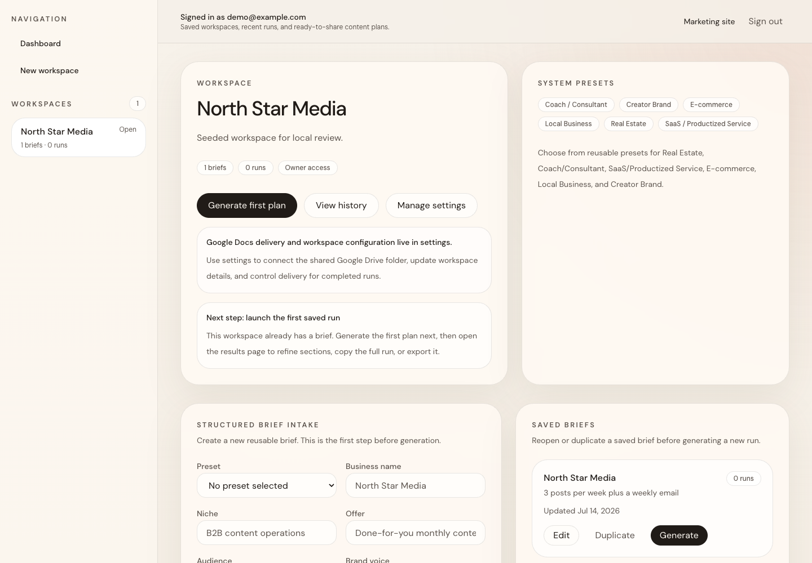
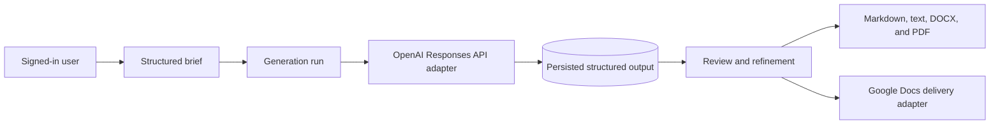

# AI Content Automation with Google Docs Delivery

**Code and architecture case study — live deployment currently unavailable.**

A multi-tenant Next.js application for turning structured content briefs into reviewable AI-assisted outputs, deterministic exports, and Google Docs delivery workflows.

[Architecture](docs/ARCHITECTURE.md) · [API flow](docs/API_FLOW.md) · [Deployment guide](docs/DEPLOYMENT.md)

## What this project demonstrates

Content teams need more than a single prompt box. They need consistent briefs, repeatable generation rules, saved run history, reviewable outputs, and a controlled path into the tools where editing continues. This repository demonstrates that workflow as an inspectable full-stack codebase.

- Structured brief creation, editing, duplication, and reusable presets
- Persisted generation runs with schema-backed OpenAI Responses API outputs
- Section-level review and refinement tools
- Deterministic Markdown, text, DOCX, and PDF exports
- Google Docs delivery through user OAuth or a service-account workflow
- Workspace-scoped data access, authentication, email verification, and password reset
- Durable PostgreSQL models for workspaces, memberships, briefs, runs, outputs, usage events, connections, and deliveries

## Screenshot

The screenshot below uses a synthetic workspace and repository seed data. It does not represent a verified live OpenAI request or Google Docs delivery.



## Architecture



Server actions validate ownership before reading or changing workspace data. Generation, formatting, and Google delivery are separated into focused server modules so provider behavior does not leak into UI components. See [the full architecture overview](docs/ARCHITECTURE.md).

## Technology stack

- Next.js 16 App Router, React 19, TypeScript, and Tailwind CSS 4
- Prisma and PostgreSQL
- NextAuth credentials authentication with JWT sessions
- OpenAI official SDK and schema-backed structured outputs
- Google APIs SDK for OAuth and Google Docs delivery
- React Hook Form and Zod validation
- Vitest for focused service, authorization, route, and UI tests

## Local evaluation

Prerequisites: Node.js 20+, npm, and PostgreSQL.

```bash
git clone https://github.com/DevCalebR/ai-content-automation-app-google-docs-delivery.git
cd ai-content-automation-app-google-docs-delivery
npm ci
cp .env.example .env
npm run db:generate
npm run db:migrate:deploy
npm run db:seed
npm run dev
```

Fill only the variables needed for the path you are evaluating. OpenAI generation, transactional email, Google OAuth, and service-account delivery require separate provider configuration. Never commit `.env` files or live credentials.

For a local UI review without provider-backed generation or delivery, set `SEED_DEMO_ACCOUNT=true` and provide your own local-only demo credentials in `.env` before seeding.

## Project structure

```text
app/                  Marketing, authentication, workspace, and delivery routes
components/           Brief, results, settings, and shared interface components
lib/ai/               Prompt composition, safety checks, and generation adapter
lib/auth/             Registration, sessions, verification, reset, and rate limits
lib/data/             Workspace-scoped query helpers
lib/google-docs/      OAuth, service-account, presentation, and delivery services
lib/results/          Deterministic output and export formatting
prisma/               Schema, migrations, and synthetic seed data
tests/                Auth, tenancy, generation, exports, and delivery coverage
docs/                 Architecture, API flow, deployment, and QA notes
```

## Validation

```bash
npm run lint
npm run typecheck
npm run test
npm run build
```

## Status and limitations

- Code and architecture case study — live deployment currently unavailable.
- Live OpenAI generation and Google Docs delivery were not used to produce the public screenshot.
- Provider-backed paths require the evaluator's own accounts, credentials, quotas, and consent configuration.
- Generation currently runs in the request workflow rather than a durable background queue.
- OAuth refresh and reconnect behavior needs broader live-provider validation before deployment.
- Billing and quota enforcement are not included.

## License

No open-source license is currently granted. Review the repository contents for evaluation only unless the owner provides separate permission.

## Related work

For another document-oriented AI workflow, inspect the [RelayWorks Document Processing Showcase](https://github.com/DevCalebR/relayworks-document-processing-showcase). More engineering work is available through [RelayWorks](https://getrelayworks.com/work/).
