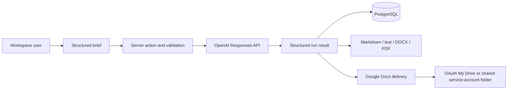

<div align="center">

# AI Content Automation with Google Docs Delivery

### Move from a structured brief to an editable document without losing review control.

**A multi-tenant Next.js workflow that generates structured content with OpenAI, keeps results reviewable, and delivers approved runs to Google Docs.**

[Architecture](docs/ARCHITECTURE.md) · [Deployment guide](docs/DEPLOYMENT.md) · [Work with RelayWorks](https://getrelayworks.com/contact/)

  

</div>

## Business problem

Content teams often move manually between intake forms, prompts, chat tools, review documents, and shared folders. That makes output inconsistent and hides which brief, model run, or revision produced the final deliverable. This application turns those steps into one traceable workflow while preserving human review.

## Key features

- Workspace-scoped briefs, reusable presets, memberships, and saved run history
- OpenAI Responses API integration with schema-backed structured output
- Safety checks before generation and section-level refinement after generation
- Deterministic Markdown, plain-text, DOCX, and PDF export paths
- Google Docs delivery through owner OAuth or a shared-folder service account
- Email verification, password reset, DB-backed auth rate limiting, and protected routes
- Per-run delivery state, destination metadata, and external document links
- Automated tests for auth, tenancy, generation actions, exports, and Google delivery

## Screenshots

A verified screenshot set is intentionally not included yet. Capture only synthetic workspaces and generated sample content using the brief in [`docs/SCREENSHOTS.md`](docs/SCREENSHOTS.md); do not publish OAuth account details, tokens, or real customer content.

## Architecture



Provider clients are server-only, workspace access is checked before mutations, and persisted run data separates generation from delivery. See [`docs/ARCHITECTURE.md`](docs/ARCHITECTURE.md) and [`docs/API_FLOW.md`](docs/API_FLOW.md).

## Tech stack

- Next.js 16, React 19, TypeScript, Tailwind CSS 4
- Prisma and PostgreSQL
- NextAuth credentials authentication with Prisma adapter
- OpenAI official SDK and Responses API
- Google APIs SDK for OAuth and Docs delivery
- Zod, Vitest, Nodemailer, PDFKit, and DOCX

## Installation

Prerequisites: Node.js 20.9+, npm, PostgreSQL, and an OpenAI API key.

```bash
git clone https://github.com/DevCalebR/ai-content-automation-app-google-docs-delivery.git
cd ai-content-automation-app-google-docs-delivery
npm ci
cp .env.example .env
```

## Configuration

Required for the core workflow:

- `DATABASE_URL`
- `OPENAI_API_KEY` and an available `OPENAI_MODEL`
- `APP_URL`, `NEXTAUTH_URL`, and a unique 32+ character `NEXTAUTH_SECRET`

SMTP enables real verification/reset email. Google OAuth credentials enable owner My Drive delivery; service-account credentials enable the legacy shared-folder path. Keep every unprefixed secret server-side. See [`.env.example`](.env.example).

## Running locally

```bash
npm run db:generate
npm run db:migrate:dev -- --name init
npm run db:seed
npm run dev
```

Open `http://localhost:3000`, create an account, verify it using the configured email path, and create a workspace. Demo seeding is opt-in and requires an explicit local-only password.

## Validation

```bash
npm run validate
```

This runs lint, TypeScript, Vitest, and a production build. Live OpenAI and Google Workspace behavior should also follow [`docs/MANUAL_QA_CHECKLIST.md`](docs/MANUAL_QA_CHECKLIST.md).

The full test suite expects the required environment values and a reachable, disposable PostgreSQL test database. It does not silently replace missing credentials or persistence with mocks.

## Deployment

Use a persistent PostgreSQL database and inject all secrets through the hosting platform. Run `npm run db:migrate:deploy` during release, configure the canonical URLs and Google OAuth redirect URI, and verify email delivery before enabling sign-up. The complete sequence is in [`docs/DEPLOYMENT.md`](docs/DEPLOYMENT.md).

## Project structure

```text
app/                 Marketing, authentication, workspace UI, and server actions
lib/ai/              Prompt composition, safety, and OpenAI generation
lib/auth/            Credentials, sessions, verification, reset, and rate limits
lib/google-docs/     OAuth, service-account, formatting, and delivery adapters
lib/results/         Export and refinement services
lib/validations/     Runtime schemas at trust boundaries
prisma/              Data model, migrations, and optional seed data
tests/               Auth, tenancy, workflow, delivery, export, and UI tests
docs/                Architecture, API flow, release, QA, and troubleshooting
```

## Design decisions

- Structured briefs and outputs make runs reproducible and easier to validate than free-form chat.
- Generation results are persisted before delivery so a provider failure does not erase work.
- Workspace ownership is checked server-side for actions and delivery configuration.
- Owner OAuth is preferred for My Drive; the service-account path remains for shared-folder deployments.
- Billing and quotas are excluded because they are not required to demonstrate the workflow.

## Known limitations

- Long generations run in the request lifecycle; there is no durable background queue.
- OAuth reconnect and revoke experiences need more production polish.
- Live Google Workspace behavior requires manual provider testing outside the automated suite.
- The app does not claim autonomous publishing, campaign performance, or fully automated approval.

## Roadmap

- Capture a synthetic end-to-end brief, review, and Google Docs delivery walkthrough
- Add durable background execution when generation volume justifies it
- Expand live Google integration coverage and reconnect handling

## License

Copyright © 2026 Caleb Rogers. All rights reserved. See [`LICENSE`](LICENSE).

## Work with me

This project demonstrates AI workflow design, multi-tenant SaaS foundations, document export, and Google API integration. To discuss a similar automation, [contact RelayWorks](https://getrelayworks.com/contact/) or review [DevCalebR on GitHub](https://github.com/DevCalebR).
